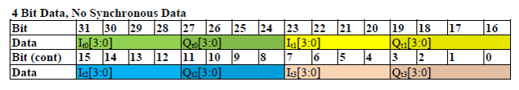
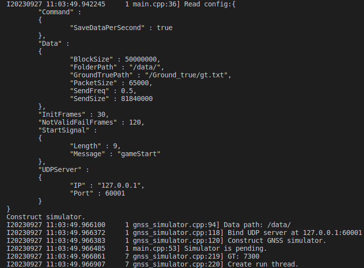

# release note:
## 20231103: 增加中频数据格式说明
## 20230926: GNSS专项赛模拟器
 

# __自主无人机竞速模拟器使用说明__  
## 简介
    RMUA2023赛季GNSS专项赛

## 官方测试环境
> ubuntu20.04  
> NVIDIA RTX3060TI gpu   
> INTEL I7 12th cpu  

## 使用说明
1. ## 安装Docker  
>安装docker
>+ `sudo apt-get install ca-certificates gnupg lsb-release`
>+ `sudo mkdir -p /etc/apt/keyrings`
>+ `curl -fsSL https://download.docker.com/linux/ubuntu/gpg | sudo gpg --dearmor -o /etc/apt/keyrings/docker.gpg`
>+ `echo "deb [arch=$(dpkg --print-architecture) signed-by=/etc/apt/keyrings/docker.gpg] https://download.docker.com/linux/ubuntu $(lsb_release -cs) stable" | sudo tee /etc/apt/sources.list.d/docker.list > /dev/null`
>+ `sudo apt-get update`
>+ `sudo apt-get install docker-ce docker-ce-cli containerd.io docker-compose-plugin`
---
>设置用户组，消除 *sudo* 限制  
>+ `sudo groupadd docker`  
>+ `sudo gpasswd -a $USER docker`  
>+ 注销账户并重新登录使新的用户组生效
>+ sudo service docker restart

2. ## 下载数据集
>+ `wget -c https://stg-robomasters-hz-q0o2.oss-cn-hangzhou.aliyuncs.com/data_3_20mins.zip`  
>+ `unzip data_3_20mins.zip -d path_to_data_store_dir`    
数据大小总计98G, 解压后为1965个50M大小的数据包，模拟器会依次读取这些数据包并发送给客户端    
>+ 数据集描述：    
&lt;Signal Recorded>  1, BEIB1-GLOL1_RF1, Bandwidth 80 MHz, Freq 1583.604 MHz, Bits 4    
&lt;Descriptions> IonosphereData_3  
&lt;Location> Unknown  
&lt;External Trigger> False  
&lt;Master/Slave> OFF   
&lt;Input Gain> RF1 Auto. RF2 Auto.  
数据说明参考 /docs/DGP01467AAA Issue 3-00 GSS6450 Data Format.pdf  

3. ## 使用模拟器
>+ `cd /path/to/IntelligentUAVChampionshipSimulator` 
>+ `docker build -t simulator03 .`  
>+ `./run_docker_simulator.sh path_to_data_store_dir`  
参数是解压后数据所在的文件夹的绝对路径   
>+ 当出现图示信息时，说明模拟器启动成功  

