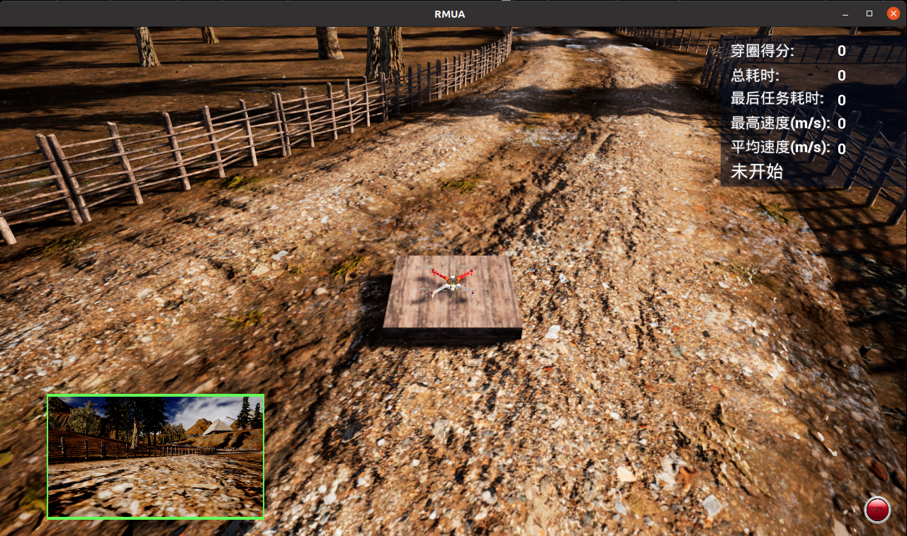
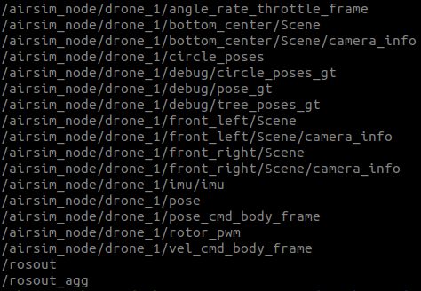
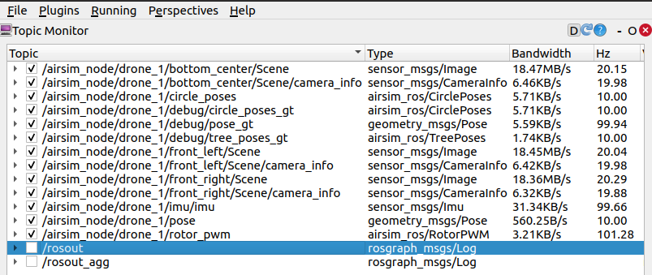
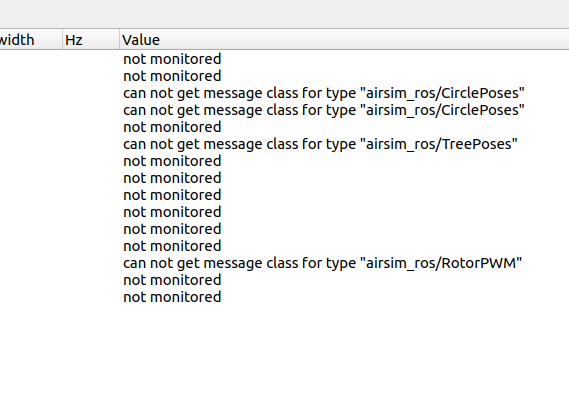

# release note:
## 20231013: 修正了障碍圈yaw值正负号相反的问题；修复了强光照射下，障碍圈显白色的问题；
## 20231007: 修复启动脚本随机数输入参数问题，将 _-seed=123_ 改为 _seed 123_
## 20230926: 修改自定义数据类型，为所有的 _airsim_ros_ 下的自定义数据类型添加了时间戳
## 20230916: 更新README，去除settings.json中小窗口图像 
## 20230908: 更新README  
 

# __自主无人机竞速模拟器使用说明__  
## 简介
    RMUA2023赛季综合赛模拟器

## 官方测试环境
> ros-noetic  
> ubuntu20.04  
> NVIDIA RTX3060TI gpu (驱动版本：470.182.03)   
> INTEL I7 12th cpu  
### 注意：若使用神经网络，建议使用双显卡以保证模拟器性能

## 使用说明
1. ## 安装Nvidia-Docker  
>确保已安装 Nvidia 驱动  
----
>安装docker
>+ `sudo apt-get install ca-certificates gnupg lsb-release`
>+ `sudo mkdir -p /etc/apt/keyrings`
>+ `curl -fsSL https://download.docker.com/linux/ubuntu/gpg | sudo gpg --dearmor -o /etc/apt/keyrings/docker.gpg`
>+ `echo "deb [arch=$(dpkg --print-architecture) signed-by=/etc/apt/keyrings/docker.gpg] https://download.docker.com/linux/ubuntu $(lsb_release -cs) stable" | sudo tee /etc/apt/sources.list.d/docker.list > /dev/null`
>+ `sudo apt-get update`
>+ `sudo apt-get install docker-ce docker-ce-cli containerd.io docker-compose-plugin`
----
>安装nvidia-container-toolkit
>+ `distribution=$(. /etc/os-release;echo $ID$VERSION_ID)`
>+ `curl -s -L https://nvidia.github.io/nvidia-docker/gpgkey | sudo apt-key add -`
>+ `curl -s -L https://nvidia.github.io/nvidia-docker/$distribution/nvidia-docker.list | sudo tee /etc/apt/sources.list.d/nvidia-docker.list`
>+ `sudo apt-get update && sudo apt-get install -y nvidia-container-toolkit`
>+ `sudo systemctl restart docker`
---
>设置用户组，消除 *sudo* 限制  
>+ `sudo groupadd docker`  
>+ `sudo gpasswd -a $USER docker`  
>+ 注销账户并重新登录使新的用户组生效
>+ sudo service docker restart
2. ## 安装ROS-Noetic 
>+ `sudo sh -c 'echo "deb http://packages.ros.org/ros/ubuntu $(lsb_release -sc) main" > /etc/apt/sources.list.d/ros-latest.list'`   
>+ `sudo apt install curl `  
>+ `curl -s https://raw.githubusercontent.com/ros/rosdistro/master/ros.asc | sudo apt-key add -`   
>+ `sudo apt update`
>+ `sudo apt install ros-noetic-desktop-full`
>+ `sudo apt install python3-catkin-tools`

3. ## 使用模拟器
### 本机启动
>+ `cd /path/to/IntelligentUAVChampionshipSimulator`  
>+ `wget https://stg-robomasters-hz-q0o2.oss-cn-hangzhou.aliyuncs.com/1012_r1.zip`  
>+ `unzip 1012_r1.zip`  
>+ `mkdir ~/Documents/AirSim`  
>+ `cp settings.json ~/Documents/AirSim`   
>+ 渲染模式  `./run_simulator.sh`  
>+ 后台模式  `./run_simulator_offscreen.sh`     
注意：脚本中的 _seed_ 参数为模拟器的随机种子，可根据需要修改   
 
>+ 使用ros查看主题  
>+ `source /opt/ros/noetic/setup.bash`    
>+ `rostopic list`    
   

### Docker启动
>+ `cd /path/to/IntelligentUAVChampionshipSimulator` 
>+ `docker build -t simulator .`  
>+ `./run_docker_simulator.sh 123`  
注意：Docker仅支持后台模式运行,启动脚本后第一个参数 _123_ 是模拟器的随机种子，可根据需要修改     
>+ 使用ros查看主题    
>+ `source /opt/ros/noetic/setup.bash`     
>+ `rostopic list`    
  

## ros数据交互
   
>用于获取数据的可订阅的主题  
>+ 下视相机   
`/airsim_node/drone_1/bottom_center/Scene`  
>+ 双目左rgb图  
`/airsim_node/drone_1/front_left/Scene`
>+ 双目右rgb图    
`/airsim_node/drone_1/front_right/Scene`
>+ imu数据  
`/airsim_node/drone_1/imu/imu`
>+ 无人机状态真值  
`/airsim_node/drone_1/debug/pose_gt`
>+ gps数据  
`/airsim_node/drone_1/pose`
>+ 障碍圈位姿真值  
`/airsim_node/drone_1/debug/circle_poses_gt`  
>+ 障碍圈参考位姿    
`/airsim_node/drone_1/circle_poses`  
>+ 赛道中生成的树的真实位置  
`/airsim_node/drone_1/debug/tree_poses_gt`
>+ 电机输入PWM信号(0:右前, 1:左后, 2:左前, 3:右后)  
`/airsim_node/drone_1/rotor_pwm`  
----
>用于发送指令的主题
>+ 姿态控制  
`/airsim_node/drone_1/pose_cmd_body_frame` 
>+ 速度控制   
`/airsim_node/drone_1/vel_cmd_body_frame`
>+ 角速度推力控制  
`/airsim_node/drone_1/angle_rate_throttle_frame`
----
>可用服务   
>+ 起飞   
`/airsim_node/drone_1/takeoff`   
>+ 降落   
`/airsim_node/drone_1/land`   
>+ 重置   
`/airsim_node/reset` 
### 注意:   
服务器仅开放 _下视相机_, _双目左rgb图_, _双目右rgb图_, _gps数据_, _障碍圈参考位姿_, _imu数据_， 规则手册中未提及的话题(_无人机状态真值_, _障碍圈位姿真值_, _赛道中生成的树的真实位置_, _电机输入PWM信号_)仅供调试程序使用。

## Q&A

### 找不到数据类型
> 使用rqt_topic时发现一些数据类型缺失，需要source官方开发案例教程中basic_dev中的airsim_ros包。具体请参考: https://github.com/RoboMaster/IntelligentUAVChampionshipBase
  

### 帧率波动
> 当帧率波动严重时，可以更换更高性能的显卡。使用3090显卡进行测试，连续运行1个小时，模拟器帧率波动维持在0.5%以下。    
也可以关闭不需要的相机降低模拟器性能需求，提升帧率稳定性。
对于本机启动，仅需要把 _~/Documents/AirSim/settings.json_ 中相应相机配置删除即可关闭该相机。  
对于docker启动，需要把 _/path/to/IntelligentUAVChampionshipSimulator_ 中的 _settings.json_ 中相应相机配置删除后重新构建镜像即可。   
   

### 时钟同步
> 模拟器时钟与本地时钟存在一定差异，建议使用 IMU 主题传出的时间戳作为全局时钟进行程序设计。

